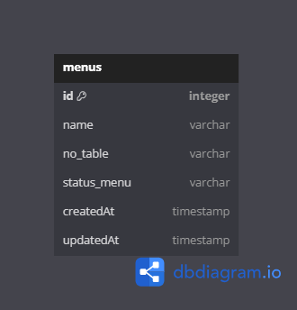

# react challenge individual

Membuat website CRUD yang terkoneksi dengan backend dan database menggunakan react pada frontend nya. Disini saya membuat website restaurant management dimana project restaurant management adalah project kelompok pada ch5.

# Frontend Server
## Setup Server

    cd frontend
    npm install
    
`npm install` diperlukan untuk menginstall semua dependencies yang diperlukan dalam project.

## Running Server

    cd frontend
    npm start

Server frontend secara default akan berjalan di `http://localhost:3000/`  

## Server Routing
| Page | Route | Default Route |
|--|--|--|
| Homepage | `/` | http://localhost:3000/ |
| Add Menu | `/menus` | http://localhost:3000/menus |
| Edit Car | `/menus?id={menuId}` | http://localhost:3000/edit?id={menuId} |
 
 

# Backend Server
## Setup Server

    cd backend
    npm install
    
`npm install` diperlukan untuk menginstall semua dependencies yang diperlukan dalam project.

## Running Server

    cd backend
    npm run start

Server backend secara default akan berjalan di `http://localhost:5000/`  
Port server bisa diganti di dalam file `backend/index.js`   

## REST API Endpoints
### List menu

List untuk menampilkan menu yang berjalan

#### *HTTP Request*
> **GET**   
> `/`

#### *Default Request URL*

    http://localhost:3000/

#### *Expected Response*
Response Code: `200`  
Response Type: `application/json`  
Response Body:  

## Api Documentation

    https://documenter.getpostman.com/view/33589235/2sA3BuVokY

# Database Design

Database proyek ini hanya menggunakan satu tabel saja karena kompleksitas data yang dibutuhkan sangat simpel. Berikut diagram yang mempresentasikan model data yang digunakan dalam aplikasi ini:
  
 